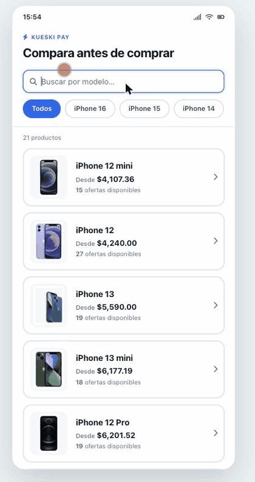

# Comparador de precios — demo

Demo en HTML, CSS y JavaScript sin build ni frameworks, que simula la experiencia
móvil de un comparador de precios integrado con Kueski Pay.

<p align="center">
  
</p>

## Pantallas

| Archivo | Descripción |
|---|---|
| `search.html` | Buscador del catálogo con filtros por texto y generación |
| `index.html` | Ficha de producto: selectores, ofertas, historial de precios y ficha técnica |
| `all-offers.html` | Listado completo de ofertas de un producto |

La navegación arranca en `search.html`; cada producto abre `index.html?product=<id>`.

## Estructura

```
utils.js                  Formato MXN, escape de HTML, tarjeta de oferta, toasts y skeletons
styles.css                Tokens del Kueski Design System (KDS light) + componentes compartidos
search.js / search-styles.css
product-loader.js         Ficha del producto, selectores e imágenes
offers-loader.js          Carga, filtrado y orden de ofertas
product-details.js        Pestañas, ficha técnica y gráfico de precios (canvas)
all-offers-loader.js      Página de todas las ofertas
server.js                 Servidor Express para desarrollo y despliegue
api/                      Datos estáticos: catálogo, productos y ofertas
```

Los precios se muestran siempre con `Intl.NumberFormat('es-MX')` en pesos mexicanos.

## Ejecutar localmente

```bash
npm install
npm start          # http://localhost:3000
```

También sirve cualquier servidor estático (`python -m http.server`, `npx http-server`),
porque la API son archivos JSON dentro de `api/`.

## API local

| Ruta | Devuelve |
|---|---|
| `GET /api/product-catalog.json` | Catálogo de productos |
| `GET /api/products/:id` | Ficha, selectores e imágenes |
| `GET /api/offers/:id` | Ofertas con historial de precios |

Las rutas responden `404` en JSON si el recurso no existe.

## Regenerar el catálogo

```bash
python generate-catalog.py
```

Recorre `api/products/` y `api/offers/` y reconstruye `api/product-catalog.json`
con el precio mínimo y la cantidad de ofertas de cada producto.

## Desplegar en Heroku

```bash
heroku login
heroku create <nombre-app>
heroku git:remote -a <nombre-app>
git push heroku main
heroku open
```

`Procfile` y el script `start` de `package.json` ya están configurados.
